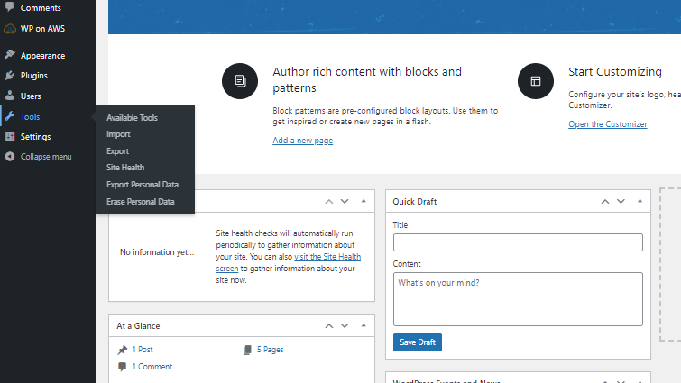
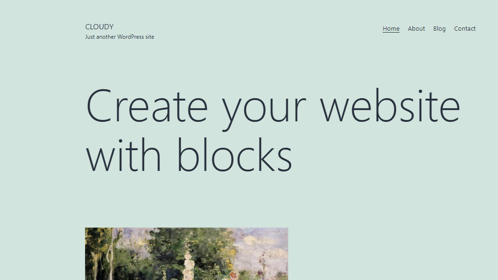
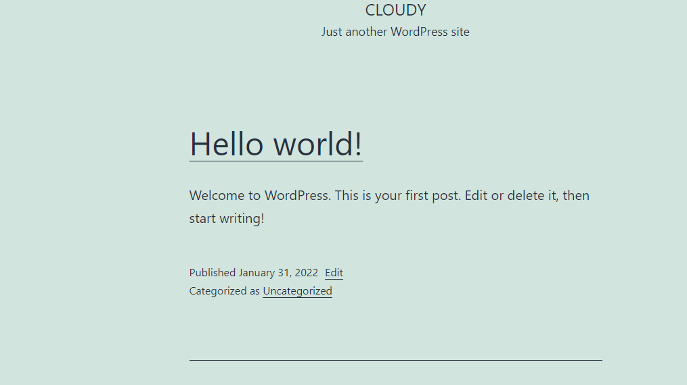

# WP-migration
<ul>
  <h3>EC2 Instances</h3>
  <li>Launch an EC2 instance and setup Lamp Stack</li>
  <li>Set up Wordpress configuration</li>
  <li>Install WordPress</li>
  <li>Setup the site</li>
  <li>Go to tools and from export download the XML file</li>
  <li>Follow the same above mentioned setup till installation</li>
  <li>Goto import in tools and install WordPress Run Plugin</li>
  <li>Activate Plugin and upload the XML file and set the author</li>
  <li>This ec2 instance will contain same WP site data from the first instance</li></ul>
  <h4>Import/Export</h4>
  <h4>Site on first ec2</h4>
  
  
   <h4>Site on second ec2</h4>
   
